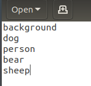

## Yolact_minimal
Minimal PyTorch implementation of [Yolact:《YOLACT: Real-time Instance Segmentation》](https://arxiv.org/abs/1904.02689).  
The original project is [here](https://github.com/dbolya/yolact).  

This implementation simplified the original code, preserved the main function and made the network easy to understand.  
This implementation has not been updated to Yolact++.  

### The network structure.  


## Environments  
PyTorch >= 1.1  
Python >= 3.6  
tensooardX  
Other common packages.  

## Prepare
- Build cython-nms  
```Shell
python setup.py build_ext --inplace
```
- Download COCO 2017 datasets, modify `self.data_root` in 'res101_coco' in `config.py`. 
- Download weights.

Yolact trained weights.  

|Backbone   | box mAP  | mask mAP | Google Drive                                                                                                   |Baidu Cloud                                                       |
|:---------:|:--------:|:--------:|:--------------------------------------------------------------------------------------------------------------:|:----------------------------------------------------------------:|
|Resnet50   | 31.5     | 29.3     | [res50_coco_800000.pth](https://drive.google.com/file/d/1pe8T2GhS7Vg9ahX3PmSgLD73rwr8NdQm/view?usp=sharing)    |[password: 2v8s](https://pan.baidu.com/s/1dMy_qRfY1I-SIyPwwk2vMQ) |
|Resnet101  | 32.9     | 30.5     | [res101_coco_800000.pth](https://drive.google.com/file/d/17mPdwqSZGMKuj5P9iVd2Il56J2UUzpzL/view?usp=sharing)   |[password: 0jq2](https://pan.baidu.com/s/1L7jSW_yoYWS8RPhbunj7hQ) |

ImageNet pre-trained weights.  

| Backbone  | Google Drive                                                                                                    |Baidu Cloud                                                        |
|:---------:|:---------------------------------------------------------------------------------------------------------------:|:-----------------------------------------------------------------:|
| Resnet50  | [resnet50-19c8e357.pth](https://drive.google.com/file/d/1Uwz7BYHEmPuMCRQDW2wD00Jbeb-jxWng/view?usp=sharing)     | [password: a6ee](https://pan.baidu.com/s/1aFLE-e1KdH_FxRlisWzTHw) |
| Resnet101 | [resnet101_reducedfc.pth](https://drive.google.com/file/d/1vaDqYNB__jTB7_p9G6QTMvoMDlGkHzhP/view?usp=sharing)   | [password: kdht](https://pan.baidu.com/s/1ha4aH7xVg-0J0Ukcqcr6OQ) |

## Improvement log
2021.1.7. Focal loss did not help, tried conf_alpha 4, 6, 7, 8.  
2021.1.7. Less training iterations, 800k --> 680k with batch size 8. 
2020.11.2. Improved data augmentation, use rectangle anchors, training is stable, infinite loss no longer appears.  
2020.11.2. DDP training, train batch size increased to 16, +0.4 box mAP, +0.7 mask mAP (resnet101).  

## Train
```Shell
# Train with resnet101 backbone on one GPU with a batch size of 8 (default).
python -m torch.distributed.launch --nproc_per_node=1 --master_port=$((RANDOM)) train.py --train_bs=8
# Train on multiple GPUs (i.e. two GPUs, 8 images per GPU).
export CUDA_VISIBLE_DEVICES=0,1  # Select the GPU to use.
python -m torch.distributed.launch --nproc_per_node=2 --master_port=$((RANDOM)) train.py --train_bs=16
# Train with other configurations (res101_coco, res50_coco, res50_pascal, res101_custom, res50_custom, in total).
python -m torch.distributed.launch --nproc_per_node=1 --master_port=$((RANDOM)) train.py --cfg=res50_coco
# Train with different batch_size (batch size should not be smaller than 4).
python -m torch.distributed.launch --nproc_per_node=1 --master_port=$((RANDOM)) train.py --train_bs=4
# Train with different image size (anchor settings related to image size will be adjusted automatically).
python -m torch.distributed.launch --nproc_per_node=1 --master_port=$((RANDOM)) train.py --img_size=400
# Resume training with a specified model.
python -m torch.distributed.launch --nproc_per_node=1 --master_port=$((RANDOM)) train.py --resume=weights/latest_res101_coco_35000.pth
# Set evalution interval during training, set -1 to disable it.  
python -m torch.distributed.launch --nproc_per_node=1 --master_port=$((RANDOM)) train.py --val_interval 8000
# Train on CPU.
python train.py --train_bs=4
```
## Use tensorboard
```Shell
tensorboard --logdir=tensorboard_log/res101_coco
```

## Evalution
```Shell
# Select the GPU to use.
export CUDA_VISIBLE_DEVICES=0
```

```Shell
# Evaluate on COCO val2017 (configuration will be parsed according to the model name).
# The metric API in this project can not get the exact COCO mAP, but the evaluation speed is fast. 
python eval.py --weight=weights/res101_coco_800000.pth
# To get the exact COCO mAP:
python eval.py --weight=weights/res101_coco_800000.pth --coco_api
# Evaluate with a specified number of images.
python eval.py --weight=weights/res101_coco_800000.pth --val_num=1000
# Evaluate with traditional nms.
python eval.py --weight=weights/res101_coco_800000.pth --traditional_nms
```
## Detect
- detect result  
  
  
```Shell
# Select the GPU to use.
export CUDA_VISIBLE_DEVICES=0
```

```Shell
# To detect images, pass the path of the image folder, detected images will be saved in `results/images`.
python detect.py --weight=weights/res101_coco_800000.pth --image=images
```
- cutout object  

```
# Use --cutout to cut out detected objects.
python detect.py --weight=weights/res101_coco_800000.pth --image=images --cutout
```
```
# To detect videos, pass the path of video, detected video will be saved in `results/videos`:
python detect.py --weight=weights/res101_coco_800000.pth --video=videos/1.mp4
# Use --real_time to detect real-timely.
python detect.py --weight=weights/res101_coco_800000.pth --video=videos/1.mp4 --real_time
```
- linear combination result  

```
# Use --hide_mask, --hide_score, --save_lincomb, --no_crop and so on to get different results.
python detect.py --weight=weights/res101_coco_800000.pth --image=images --save_lincomb
```

## Train on PASCAL_SBD datasets
- Download PASCAL_SBD datasets from [here](http://home.bharathh.info/pubs/codes/SBD/download.html), modify the path of the `img` folder in `data/config.py`.
- Then, generate a coco-style json.
```Shell
python utils/pascal2coco.py --folder_path=/home/feiyu/Data/pascal_sbd
```
- Download the Yolact trained weights.
[Google dirve](https://drive.google.com/file/d/1QHO_FEbsFJvN9_L4WZqCpKFtUre6iMVb/view?usp=sharing),   [Baidu Cloud: eg7b](https://pan.baidu.com/s/1KM5yV4IxHiAX4Iwn5G_TuA)

```Shell
# Training.
python -m torch.distributed.launch --nproc_per_node=1 --master_port=$((RANDOM)) train.py --cfg=res50_pascal
# Evalution.
python eval.py --weight=weights/res50_pascal_120000.pth
```

## Train custom datasets
- Install labelme  
```Shell
pip install labelme
```
- Use labelme to label your images, only ploygons are needed. The created json files are in the same folder with the images.  

- Prepare a 'labels.txt' like this, this first line: 'background' is always needed.  

- Prepare coco-style json, pass the paths of your image folder and the labels.txt. The 'custom_dataset' folder is a prepared example.  
```Shell
python utils/labelme2coco.py --img_dir=custom_dataset --label_name=cuatom_dataset/labels.txt
```
- Edit `CUSTOM_CLASSES` in `config.py`.  
  
Note that if there's only one class, the `CUSTOM_CLASSES` should be like `('dog', )`. The final comma is necessary to make it as a tuple, or the number of classes would be `len('dog')`.  
- Choose a configuration ('res101_custom' or 'res50_custom') in `config.py`, modify the corresponding `self.train_imgs` and `self.train_ann`. If you need to validate, prepare the validation dataset by the same way.  
- Then train.  
```Shell
python -m torch.distributed.launch --nproc_per_node=1 --master_port=$((RANDOM)) train.py --cfg=res101_custom
```
- Some parameters need to be taken care of by yourself:
1) Training batch size, try not to use batch size smaller than 4.
2) Anchor size, the anchor size should match with the object scale of your dataset.
3) Total training steps, learning rate decay steps and the warm up step, these should be decided according to the dataset size, overwrite `self.lr_steps`, `self.warmup_until` in your configuration.