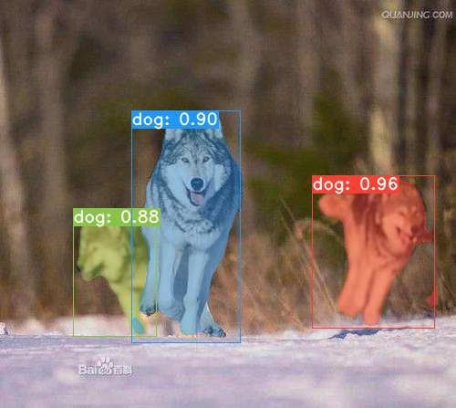

## Yolact_minimal
Minimal PyTorch implementation of Yolact:《YOLACT: Real-time Instance Segmentation》.

The original project is [here](https://github.com/dbolya/yolact).  
Related paper is [here](https://arxiv.org/abs/1904.02689).  
This implementation simplified the original code, preserved the main function and made the network easy to understand.   

Following instruction is based on resnet-101.  
### The network structure.  


## Environments
PyTorch 1.1.  
Python 3.6 or above.    
Other common packages.   

## Prepare
- Firstly, modify the paths of training and val datasets in `data/config.py` in line 72-77.  
- If some directories are missed, just create them by yourself.   
- Download the pretrained weights.  
[ImageNet pretrained weights](https://drive.google.com/file/d/1tvqFPd4bJtakOlmn-uIA492g2qurRChj/view?usp=sharing)   
[Yolact pretrained weights](https://drive.google.com/file/d/1UYy3dMapbH1BnmtZU4WH1zbYgOzzHHf_/view?usp=sharing)    


## Train
```Shell
# Trains using the base config with a batch size of 8 (the default).
python train.py --config=yolact_base_config

# Resume training (just pass the .pth file to the model by using --resume).
python train.py --config=yolact_base_config --resume weights/yolact_base_2_35000.pth

# Using --batch_size, --lr, --momentum, --decay to set the batch size, learning rate, momentum and weight decay.
python train.py --config=yolact_base_config --batch_size=4
```

## Val
```Shell
# Evaluate on COCO val2017.
python eval.py --trained_model=weights/yolact_base_54_800000.pth
```
The results should be:


```Shell
# Create a json file and then use the COCO API to evaluate the result.
python eval.py --config=yolact_base_config --output_coco_json
# Then,
python coco_eval.py

# Benchmark
python eval.py --trained_model=weights/yolact_base_54_800000.pth --benchmark --max_images=1000
```
## Detect

```Shell
# Detect images, pass the path of your image directory to --image_path.
python eval.py --trained_model=weights/yolact_base_54_800000.pth --image_path images
# Detect a video, pass the path of your video to --video.
python eval.py --trained_model=weights/yolact_base_54_800000.pth --video video/1.mp4
# Use --hide_mask, --hide_score, --show_lincomb and so on to get different results.
python eval.py --trained_model=weights/yolact_base_54_800000.pth --image_path images --hide_mask
```
More details wait to be added....................
